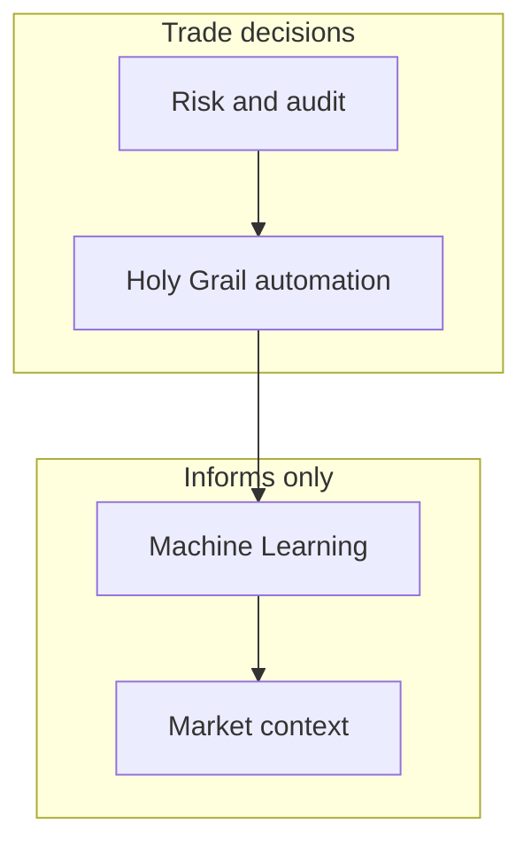
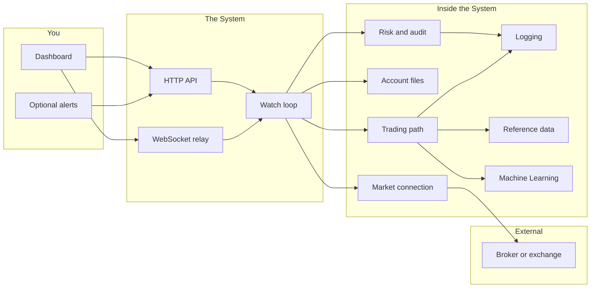

# Architecture Overview

**Holy Grail's Automated Trading** · **Holy Grail Z-2311** · [ninongbee000@gmail.com](mailto:ninongbee000@gmail.com)

Use this page when you need a map of the Holy Grail System. The diagrams and module names here describe the **deployed System**. This git repository stores the guide only; trading, broker sessions, account files, and journals live in the live System.

When you deploy Holy Grail we can expect crypto, stocks, and forex in a single System instance. Enable automation for repetitive watch-and-act work. Run risk before any order path executes. Use Machine Learning to read trade and skip history for prioritization hints, it stays advisory and never submits orders or bypasses risk.

Module labels in this document are Holy Grail product language, not official names from exchanges or brokers.

---

## When layers disagree

**Risk and audit** — Apply pre-trade checks, exposure and margin limits, rate discipline, and an append-only audit trail before automation acts.

**Holy Grail automation** — Run the watch–screen–act path you turn on after risk clears.

**Machine Learning** — Read trade and skip history to adjust prioritization or labels. Log every output and evaluate it through the same risk screening as deterministic rules. Do not release an order because a model recommended it.

---

## Bird's-eye diagram

---

## What each part does

**Risk and audit** — Check whether an order may execute. Track exposure, margin, and symbol policy, and keep a record you can read and analyze later.

**Trading path** — Run the Holy Grail loop you enabled. Watch markets, screen candidates, route only orders you allowed, and keep the portfolio view aligned with live positions.

**Market connection** — Connect over REST and streams for your chosen venue. Budget request rates, apply automatic delay and backoff when limits apply, and map base URLs and stream endpoints from that venue's official API documentation. See [Example venues and API references](#example-venues-and-api-references).

**Settings** — Merge built-in defaults with your **account files** (accounts and related settings). Use toggles to set automation and risk behavior according to your runbook.

**Machine Learning support** — Review advisory feedback from outcomes, pattern memory, and ranking helpers. Do not grant this layer execution keys or order authority.

**Logging** — Keep logs readable under load. Deduplicate repeated entries where that helps you review faster.

**Reference data** — Cache market context such as filters and universes. Keep strategy parameters in your deployment, not in this documentation repository.

**Runtime mode** — Choose monitor or live operation. Turn automation on or off according to your runbook.

---

## Example venues and API references

Holy Grail runs **one account per deployment**; that account connects to **one primary venue** at a time (crypto exchange, forex stack, or retail broker). Use account files to record venue name, environment (live or paper), base URLs, and permission scopes. Read each vendor's official documentation for authentication, user streams, and rate limits, then align your deployment with **Exchange rate limits** in Operating guidance below.

**Crypto — Binance** — Follow Binance developer documentation for REST and WebSocket usage. Use separate doc sets for spot versus USDⓈ-M futures if you trade both. Store API keys and IP allowlists in account configuration in the deployment.

- [Binance Developer Center](https://developers.binance.com/en)
- [Binance Spot API documentation](https://developers.binance.com/docs/binance-spot-api-docs/README)
- [Binance USDⓈ-M Futures documentation](https://developers.binance.com/docs/derivatives/usds-margined-futures/general-info)

**Crypto — Bitget** — Follow Bitget REST and WebSocket guides for the products you enable (spot, margin, futures). Sign requests with the vendor's key, timestamp, and passphrase rules, and keep clock skew within their limits.

- [Bitget API introduction](https://www.bitget.com/api-doc/common/intro)
- [Bitget spot API documentation](https://bitgetlimited.github.io/apidoc/en/spot/)

**Forex — MetaTrader 5 (MT5)** — When you bridge through MT5, keep **MetaTrader 5** (the platform) separate from **M5** (the five-minute chart timeframe) in runbooks and account file labels. Expert Advisors and scripts may reach external REST APIs through `WebRequest` only for URLs you allowlisted in the terminal.

- [MQL5 WebRequest reference](https://www.mql5.com/en/docs/network/webrequest)
- [MetaTrader 5 Help](https://www.metatrader5.com/en/terminal/help)

**Forex — broker REST (general)** — Many FX brokers publish REST or FIX bridges. Start from the broker's primary developer portal and mirror connection settings in account files. Example: [OANDA REST v20 introduction](https://developer.oanda.com/rest-live-v20/introduction/).

**Stocks — US equities (published APIs)** — Retail US stock automation requires a broker that ships official developer documentation. Map one broker account per deployment in account files; store credentials in the deployment, never in git.

**Stocks — Alpaca** — Use Alpaca Trading and Market Data APIs for US equities (and crypto where your account allows). Read the US docs hub and validate in paper before live keys.

- [Alpaca US API documentation](https://docs.alpaca.markets/us/)

**Stocks — Interactive Brokers** — Follow IBKR API guidance for Client Portal Web API or TWS API integration. Configure gateway, session, or OAuth flows as the vendor documents.

- [IBKR API overview](https://www.interactivebrokers.com/campus/ibkr-api-page/)
- [Client Portal Web API documentation](https://interactivebrokers.github.io/cpwebapi/)

**Stocks — Tradier** — Use Tradier's brokerage API for US equities and options when enabled on your account.

- [Tradier API documentation](https://documentation.tradier.com/)

**Stocks — Charles Schwab** — Use the Schwab Trader API through the developer portal after app registration and OAuth setup where required.

- [Schwab Developer Portal](https://developer.schwab.com/)

**Stocks — tastytrade** — Use tastytrade's open API documentation for supported account and trading endpoints.

- [tastytrade Developer Documentation](https://developer.tastytrade.com/)

**Examples, not endorsements** — Links name common venues users ask about. You remain responsible for each platform's terms of service, market access, and compliance in your jurisdiction.

---

## Where data lives (in the live System)

**Operational stores** — Plan separate locations for connection health and rate windows, non-secret account configuration, trading lists and caches, journals (including history Machine Learning can learn from), and append-only security audit logs. Keep API credentials in account configuration in the deployment, never in git.

This documentation folder does not ship any of that data.

---

## What you touch in the UI

**Dashboard** — Review status and balances at a glance.

**Portfolio** — Track total exposure across open positions.

**Position detail** — Act on one symbol when you need a targeted change.

**Refresh behavior** — Rely on shared refresh logic so pages do not fight each other.

---

## Starting the process

**Boot sequence** — Load config, wire modules, bring HTTP and WebSocket online, then stagger exchange work with automatic delay and backoff so startup stays within rate limits.

---

## Operating guidance

When you deploy and run Holy Grail, keep the following in mind. They describe how the System is meant to behave and how this documentation relates to your installation.

**Stack order** — Run risk review before any automated action. Place Machine Learning after risk and automation. Keep execution authority with your configured filters and screening rules, not with models.

**Machine Learning stays advisory** — Allow models to reprioritize watch lists and label scenarios from journal history. Do not use models to approve orders, store credentials, or skip risk checks.

**Auditable decisions** — Record a reason in the append-only log for every automated trade and every skip. Reconstruct desk behavior from logs when you review.

**Symbol rules by intent** — Apply strict symbol validation on new entries to contain open risk. On exits, align with positions the exchange already recognizes so closes are not blocked by entry-only filters.

**One account per deployment** — Tie each installation to a single trading account and book. Keep exposure, credentials, and journals in that bounded scope for review.

**Exchange rate limits** — Pace REST and stream traffic with automatic delay and backoff. Wait within published limits rather than driving repeated API errors.

**Docs versus live System** — Use this repository for architecture and process guides. Run trading, account files, broker sessions, and journals in the live System.

---

## Next

[PROCESS_FLOW.md](./PROCESS_FLOW.md) — walk through setup, steady state, and review