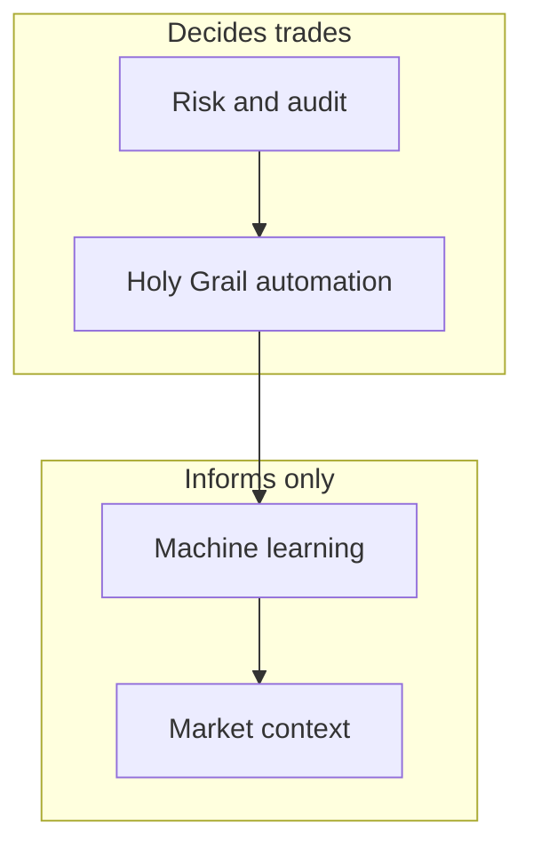
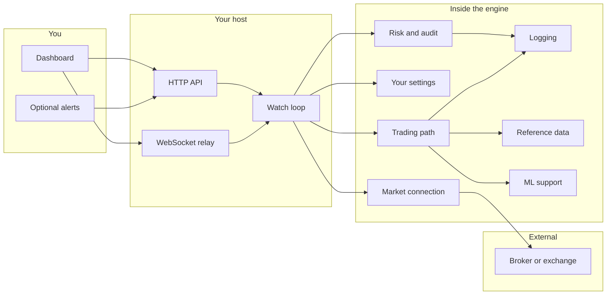

# Architecture Overview

**Holy Grail's Automated Trading** · **Holy Grail Z-2311** · [ninongbee000@gmail.com](mailto:ninongbee000@gmail.com)

This is how I think about the system: one person, three markets (crypto, stocks, forex), one engine on your box. Automation does the repetitive work. Risk sits above it. Machine learning listens to your history and helps you see patterns — it never gets the keys to the execution door.

The module names below are how I explain the product to humans, not official vendor terms.

---

## What wins when things disagree

Automation is the watch–screen–act path you enable. Risk wraps it: pre-trade checks, exposure and margin limits, rate discipline, and an append-only audit trail. ML, at a high level: it reads trade and skip history over time and can improve how the watch loop prioritizes symbols or labels scenarios. Every ML output is logged and still subject to the same gates — no order because a model said so.

---

## Bird's-eye diagram

---

## What each part does

**Risk and audit** — The first and last word on whether an order may go out. Exposure, margin, symbol policy, and a record you can read later.

**Trading path** — The Holy Grail loop: watch, screen, route orders you have allowed, show the portfolio.

**Market connection** — REST, streams, rate budgeting, retries when the exchange gets grumpy.

**Settings** — Defaults plus your env file; toggles for automation and risk.

**ML support** — Feedback from outcomes, pattern memory, ranking helpers. Support role only.

**Logging** — Readable under load; dedupe where it helps.

**Reference data** — Cached market context (filters, universes) without baking strategy into this doc repo.

**Runtime mode** — Monitor vs live, automation on or off.

---

## Where data lives (in the real app)

Connection health and rate windows live in one place; your non-secret profile settings in another; trading lists, caches, and journals (including history ML can learn from) in another; security audit as append-only logs. API keys stay in the environment, never in git.

This documentation folder does not ship any of that data.

---

## What you touch in the UI

Main dashboard for status and balances, portfolio for total exposure, position detail when you need to act on one symbol, shared refresh logic so pages do not fight each other.

---

## Starting the process

One Node process loads config, wires modules, brings HTTP and WebSocket online, then eases into exchange work so you do not spike rate limits on boot.

---

## Principles I do not bend

1. **Risk before automation before ML** — That order is the product.
2. **ML advises; gates decide** — Reprioritize and label, do not bypass.
3. **If it traded or skipped, log why** — No silent black-box moments.
4. **Strict symbols on new entries, lighter on exits** — Open risk is protected; closing should not get stuck on discovery rules.
5. **One operator per deployment** — Simple mental model.
6. **Respect rate limits** — Back off instead of pretending the error did not happen.
7. **This repo is the map; the app is the territory.**

---

## Next

[PROCESS_FLOW.md](./PROCESS_FLOW.md) — walk through time, not just boxes
