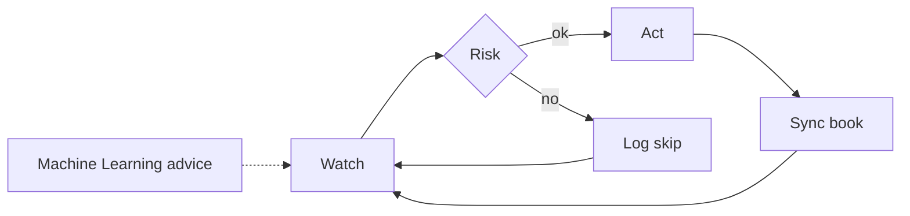
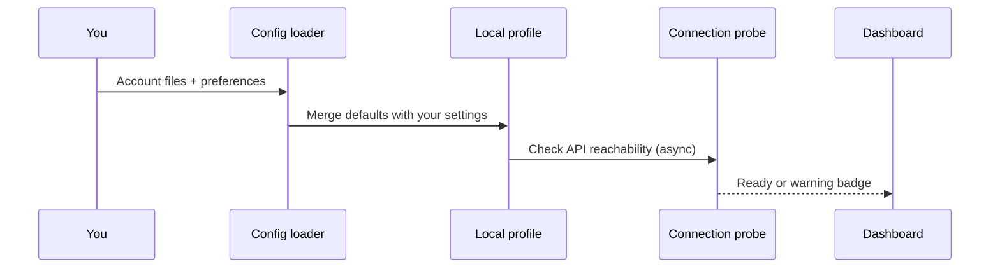
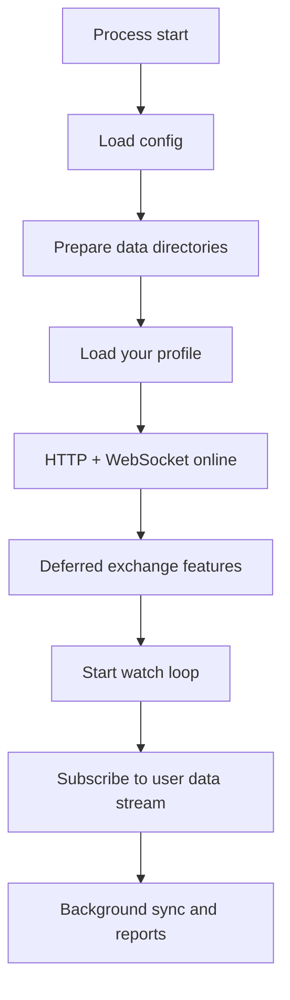
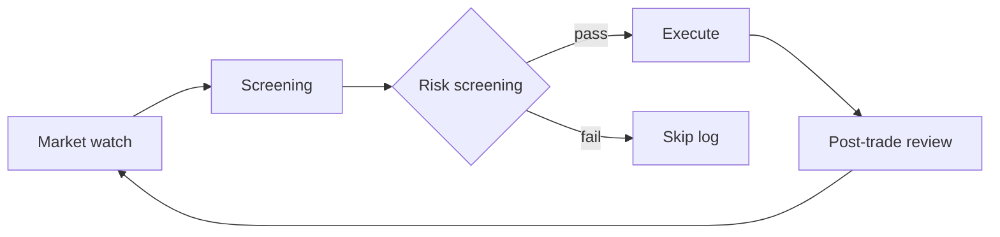
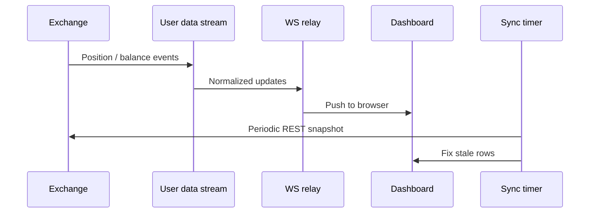
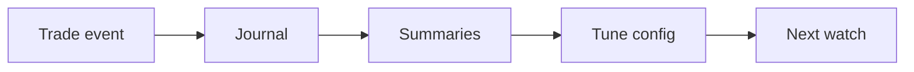

# Process Flows

**Holy Grail's Automated Trading** · **Holy Grail Z-2311** · [ninongbee000@gmail.com](mailto:ninongbee000@gmail.com)

**Scope of this guide** — Follow these pages when you set up Holy Grail, reach steady state, or review desk behavior. Keep the order consistent: **risk checks**, then **automation**, then optional **Machine Learning** input from your journals. Configure concrete thresholds and proprietary rule names in your deployment and account files; this public guide omits them.

---

## The loop you live in

**Daily loop** — Watch the market, run risk, act only when risk passes, sync the book, and repeat. Treat Machine Learning suggestions as advisory only; do not let them skip the risk check or place an order alone.

---

## First time setup

**Initial deploy** — Add account files and preferences for your primary venue (crypto exchange, forex broker or MT5 bridge, or retail broker API). Check that venue's official documentation for auth, streams, and rate limits before you go live. Expect the System to merge defaults, probe the API without freezing the UI, and show a warning before trading logic runs if credentials or connectivity fail.

---

## Boot until steady state

**Startup** — Bring the dashboard online first. Stage heavier exchange work with automatic delay and backoff so boot stays within rate limits. Run the watch loop on its schedule, separate from one-off manual actions.

---

## When the system looks for new risk

**New risk scan** — Screen using rules you configured in the deployed System. Run risk on positions, cooldowns, margin, exposure, and connectivity before automation executes. Log a reason for every skip. Use Machine Learning scores or labels as extra context, not as approval to trade.

---

## Keeping the book honest

**Book sync** — Treat the exchange as the source of truth for open risk. Push stream updates to the UI and run periodic REST sync to fix drift. Follow execution symbol rules on closes so entry-only filters do not block exits.

---

## From the dashboard

- **See positions** — Read from WebSocket or cache on the live connection.
- **Partial close** — Send UI → API → symbol check → order in sequence.
- **Refresh balances** — Pull REST snapshots and update cache.
- **Alerts** — Route optional webhooks or chat to a channel you own.

---

## Types of risk rules (thresholds not listed here)

When you tune policy, these categories override automation triggers and Machine Learning hints:

- **Session** — Act only when your profile is loaded and automation mode allows it.
- **Symbols** — Block disallowed names on new entry.
- **Exposure** — Cap total open risk.
- **Margin** — Block new risk when collateral is too thin.
- **Connectivity** — Apply automatic delay and backoff when rate limits apply; throttle rather than surfacing avoidable errors.
- **Audit** — Write allows and denies to a trail that automation and Machine Learning both honor.

---

## After trades: learn and tune

**Post-trade review** — Write events to journals for reports and, in the running System, for high-level Machine Learning feedback. Tune automation and risk from log evidence and any advisory model output recorded there; this repo does not specify models.

---

## Symbol strictness (quick reminder)

**New entries** — Keep symbol checks strict.

**Exits** — Match symbols the exchange already has open.

**Live relay** — Use exchange strings after sanitization.

Module detail: [ARCHITECTURE.md](./ARCHITECTURE.md)
