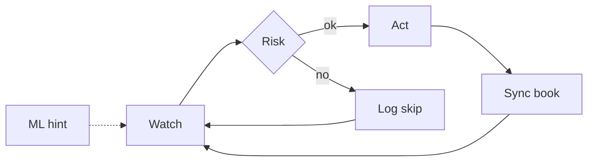
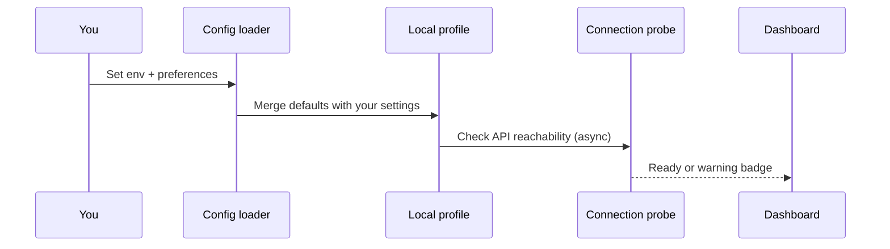
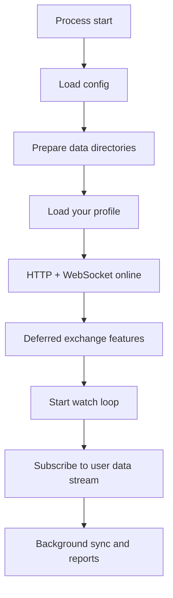
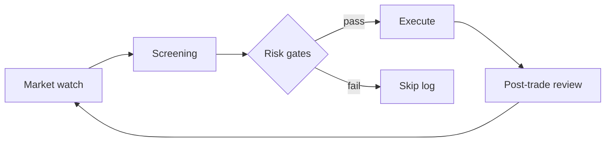
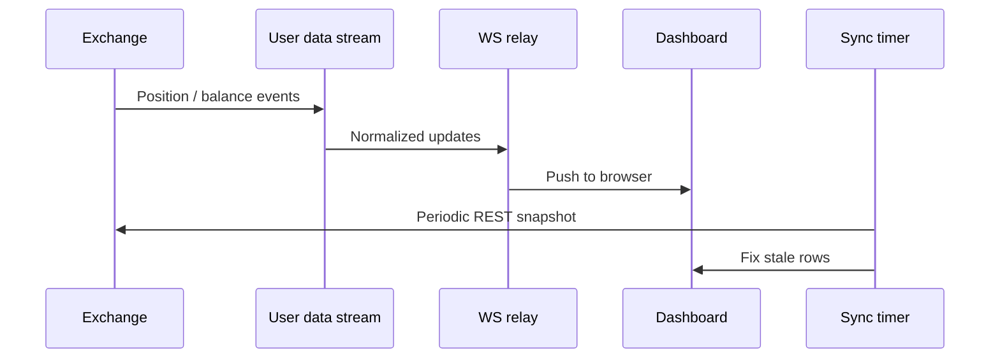
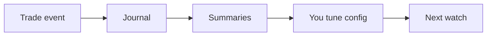

# Process Flows

**Holy Grail's Automated Trading** · **Holy Grail Z-2311** · [ninongbee000@gmail.com](mailto:ninongbee000@gmail.com)

Walkthrough from first setup to review. Same story everywhere: risk first, then Holy Grail automation, then optional ML nudges from your journals. I keep numbers and secret rule names out of this public doc on purpose.

---

## The loop you live in

Most days look like this: watch the market, run risk, act only on pass, sync the book, repeat. ML may read past cycles and suggest what to weigh more heavily — it never skips the risk diamond or places an order alone.

---

## First time setup

You drop in env and preferences. The engine merges them with defaults and probes the API without freezing the UI. If something is wrong with keys or connectivity, you see a warning before any trading logic pretends things are fine.

---

## Boot until steady state

The desk shows up first; heavy exchange work comes in stages. The watch loop then ticks on its own schedule, separate from one-off manual clicks.

---

## When the system looks for new risk

Screening follows whatever you configured in the deployed app. Risk runs first — positions, cooldowns, margin, exposure, connectivity. Only then may automation execute. Every skip gets a reason in the log. ML scores or labels, if present, are extra context, not approval.

---

## Keeping the book honest

The exchange owns the truth for open risk. Streams keep the UI fresh; a periodic sync fixes drift. When you close, symbol handling follows execution rules so you are not blocked by the same filters used for brand-new entries.

---

## From the dashboard

- **See positions** — WebSocket or cache from the live connection.  
- **Partial close** — UI → API → symbol check → order.  
- **Refresh balances** — REST → cache update.  
- **Alerts** — Optional webhook or chat to a channel you own.

---

## Types of risk rules (no magic numbers here)

These categories beat automation triggers and ML hints every time:

- **Session** — Only when your profile is loaded and automation mode allows it.  
- **Symbols** — Block garbage or disallowed names on new entry.  
- **Exposure** — Cap how much you can have on at once.  
- **Margin** — Block new risk when collateral is too thin.  
- **Connectivity** — Back off when the exchange rate-limits you.  
- **Audit** — Allow and deny both leave a trail automation and ML must respect.

---

## After trades: learn and tune

Events land in journals for reports and, in the running app, for ML feedback at a high level — I do not spec models here. You change automation and risk from evidence in the logs, not from a model whispering off the record.

---

## Symbol strictness (quick reminder)

New entries: strict. Exits: match what the exchange already has open. Live relay: trust exchange strings after sanitization.

Module boundaries: [ARCHITECTURE.md](./ARCHITECTURE.md)
