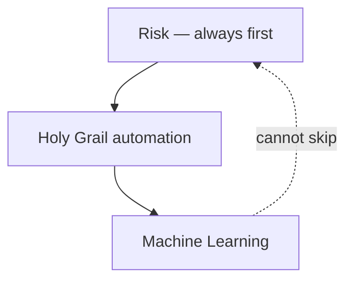
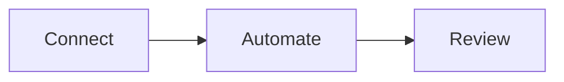

# Holy Grail's Automated Trading

**Author:** Holy Grail Z-2311 · [ninongbee000@gmail.com](mailto:ninongbee000@gmail.com)

This repository is the **user guide** for Holy Grail's Automated Trading—a self-hosted desk you run for **one account** across crypto, stocks, and forex. Use these pages to learn how the System is organized, how a normal day flows, and what to configure on your side before anything trades.

When you deploy, install and run the Holy Grail System on hardware you control. Maintain **account files** (accounts and related settings), broker or exchange connections, and journals on that host. This git project holds **documentation only**.

---

## How to use this guide

| Start here                               | When it helps                                                                                                         |
| ---------------------------------------- | --------------------------------------------------------------------------------------------------------------------- |
| [ARCHITECTURE.md](./ARCHITECTURE.md)     | Review the module map, venue API references, data layout, and operating guidance before you change automation or risk |
| [PROCESS_FLOW.md](./PROCESS_FLOW.md)     | Follow setup, boot, and steady-state review of the watch loop                                                         |
| [project.meta.json](./project.meta.json) | Index or search metadata about this doc set                                                                           |

Read [Operating guidance](./ARCHITECTURE.md#operating-guidance) when you want the short list of behaviors to expect from a healthy deployment.

---

## What you configure on your side

**Account files** — Merge System defaults with venue identity, automation toggles, and risk preferences for your deployment. Keep non-secret settings in account files on the host; never commit API keys or live credentials to git.

**API connection** — Create API credentials in your venue's developer portal. Record key permissions, REST base URLs, and stream endpoints in account files so the System can authenticate and respect vendor rate limits.

**Stack order** — Expect risk checks first on every path that can send an order. Run automation on the watch loop you allow. Use Machine Learning to read trade and skip history for prioritization or labels; do not treat it as order approval or credential storage.

**Venue connection** — Point each deployment at one primary venue—for example Binance or Bitget for crypto, an MT5 bridge or broker REST stack for forex, or a US equities broker with a published trading API (Alpaca, Interactive Brokers, Tradier, Charles Schwab, tastytrade, and others listed in ARCHITECTURE). Mirror official REST and stream patterns in account files, and rely on automatic delay and backoff when limits apply.

**Official references** — Retail US equities require a broker with a published trading API. See [Example venues and API references](./ARCHITECTURE.md#example-venues-and-api-references) for documentation links and connection notes.

---

## How the desk is organized

**Risk and audit** — Check margin, exposure, symbols, and connectivity before any manual or automated order. Log every allow and deny. Do not send an order when risk does not clear.

**Holy Grail automation** — Run the watch loop after risk passes. Screen markets and act only on paths you enabled, aligned with live positions.

**Machine Learning** — Read journal history for prioritization hints. Treat output as advisory alongside rules and logs, not as a substitute for risk screening.

---

## Who this guide is for

**Self-hosted users** — Run automation without handing credentials to someone else's cloud.

**Review-focused traders** — Keep a written reason for every trade and skip when you close the day.

**Advisory Machine Learning** — Include models in the workflow with a clear non-execution role, not unattended auto-trading.

---

## What a normal day looks like

1. **Connect** — Confirm market and account feeds are healthy; let the System monitor connectivity in the background.
2. **Automate** — Run the watch loop: screen, pass risk, then execute only actions you approved.
3. **Review** — Adjust policy from the dashboard and journals. Use history and Machine Learning feedback together with the audit trail as the record of what ran.

Expect a **watch → screen → act** loop with logged outcomes, **risk checks** on manual and automated orders, a **live dashboard** with stream updates, and **journals and skip logs** you can read and analyze later.

---

## What the deployed System is built with

**Typical stack** — Run Node.js and Express, WebSockets for live updates, HTML/JS dashboards, JSON state and append-only journals, and a process manager you choose. Connect brokers and exchanges over REST/WebSocket; add chat or webhook alerts if you need them.

---

## Disclaimer

This documentation describes software for operating a trading desk. It is **not financial advice** and does not recommend what to buy or sell. Past behavior of any setup does not promise future results. You are responsible for exchange rules, licensing, and laws that apply where you trade.

## License

[MIT License](./LICENSE)

## Contributing

Keep secrets, live account files, and strategy parameters out of commits.

**Contact:** [ninongbee000@gmail.com](mailto:ninongbee000@gmail.com)
