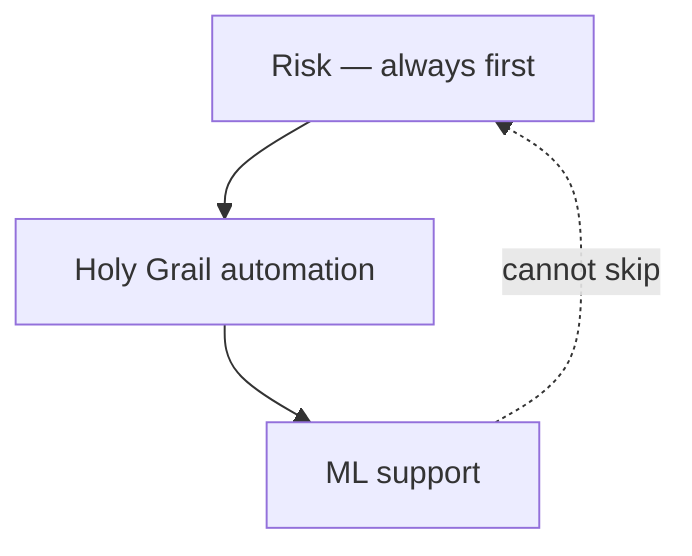
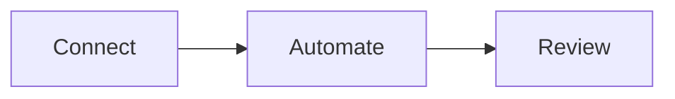

# Holy Grail's Automated Trading

**Author:** Holy Grail Z-2311 · [ninongbee000@gmail.com](mailto:ninongbee000@gmail.com)

You run your own book — crypto, stocks, or forex — and you do not want a hosted bot holding your keys or guessing your size. Holy Grail's Automated Trading is the story of how I built a **self-hosted desk** for that: one operator, one process, your machine.

The engine does what a patient assistant would do if they followed rules exactly: **watch the market**, **check risk before anything leaves**, then **act** only when you have allowed it. Machine learning is in the loop too, but in a humble role — it learns from what already happened in your logs and helps prioritize what to look at next. It does not get to override your gates or fire orders on its own.

**This repo is documentation only.** There is no live trading code here, no API keys, and no connection to any broker.

---

## The three things that matter

**Automated trading** is the heartbeat — scans, screening, and the execution paths you turn on, kept in sync with your live positions.

**Risk management** is the boss. Margin, exposure, bad symbols, rate limits, and a paper trail for every allow or deny. If risk says no, nothing trades — period.

**Machine learning** sits underneath that, quietly. It remembers outcomes, nudges ranking and context, and stays auditable. Rules and logs still decide what hits the market.

---

## How the layers stack

---

## Who might care about this

If you are an independent or desk-style trader who wants real automation without shipping credentials to someone else's cloud — this is the design language I use.

If you are tired of tools that sound smart but cannot explain why they skipped a trade — everything here is built around **logged reasons**, not vibes.

If you want ML in the stack but not a magic black box — learning feeds the loop; it does not replace it.

---

## What you actually get

- A **watch → gate → act** loop you control, not a mystery cron job.
- **Risk checks** before automated or manual orders.
- **Light-touch ML** in the running app — outcome-aware, not auto-trade-by-default.
- **One profile**, one broker or exchange connection.
- A **live dashboard** with streams when balances or positions move.
- **Journals and skip logs** so you can answer "why?" later.

---

## Day to day, in three steps

1. **Connect** — Your feeds stay healthy; the engine watches that quietly.
2. **Automate** — Holy Grail's watch loop runs: screen, risk gate, then only approved actions.
3. **Review** — You use the dashboard and logs to tune policy. History is there for you and for ML feedback — not for blind trust in a model.

Go deeper: [ARCHITECTURE.md](./ARCHITECTURE.md) (how it is put together) · [PROCESS_FLOW.md](./PROCESS_FLOW.md) (what happens when)

---

## Built with

Node.js and Express on the server, WebSockets for live updates, simple HTML/JS dashboards, JSON state and append-only journals in the deployed app, plus whatever process manager you use to keep it running. Brokers and exchanges over REST/WebSocket; optional chat alerts if you want them.

---

## Files in this repo

- [ARCHITECTURE.md](./ARCHITECTURE.md) — modules and principles  
- [PROCESS_FLOW.md](./PROCESS_FLOW.md) — startup through review  
- [CONTEXT_PROMPT.md](./CONTEXT_PROMPT.md) — if you or an AI extend these docs safely  
- [project.meta.json](./project.meta.json) — keywords for profiles and search  

---

## Disclaimer

This is not financial advice. It describes software for running a trading desk, not what to buy or sell. Past behavior of any setup does not promise future results. Know your exchange rules and your local laws.

## License

[MIT License](./LICENSE)

## Contributing

Read [CONTEXT_PROMPT.md](./CONTEXT_PROMPT.md) first. Please do not commit secrets, live configs, or strategy parameters.

**Contact:** [ninongbee000@gmail.com](mailto:ninongbee000@gmail.com)
